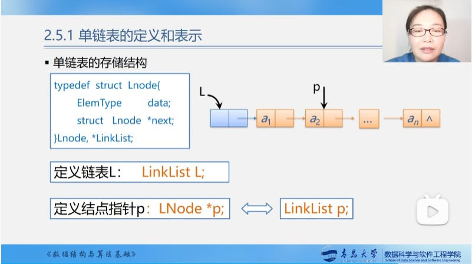
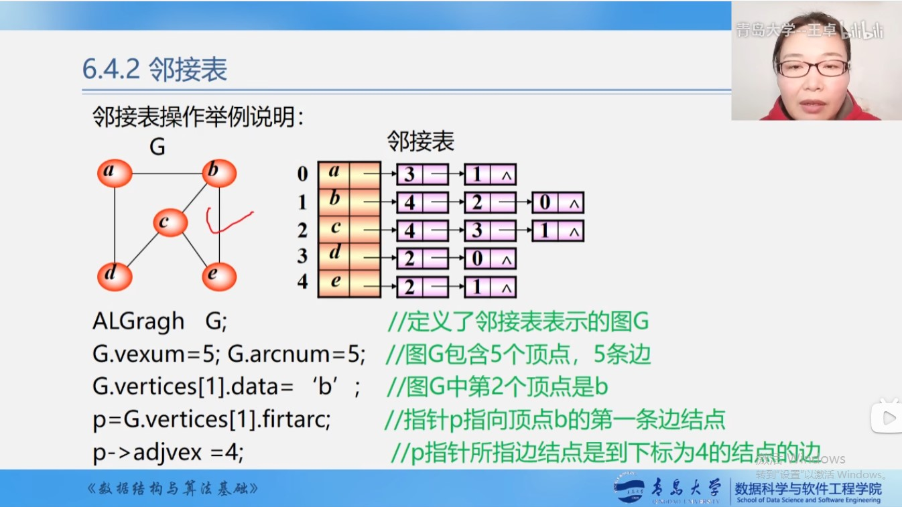

# 线性表


## 1. 顺序线性表（Sequential List）


特点：逻辑上相邻的数据元素，其物理次序也是相邻的。

​		假设线性表的每个元素需占 $\ell $ 个存储单元，则第 `i+1` 个数据元素的存储位置和第 `i` 个数据元素的存储位置之间满足关系：


$$
LOC(a_{i+1})  = LOC(a_{i}) + \ell 
\\
\\
LOC(a_{i})  =LOC(a_{1}) +(i-1)*\ell
$$

### 1.1 线性表的定义

```c
//1.数组静态分配空间
#define MaxSize 100
typedef struct
{
    ElemType elem[MaxSize];	
    int length;
}SeqList;

//2.数组动态分配空间
typedef struct
{
    ElemType *elem;	
    int length;
}SeqList;
SeqList L;
L.elem=(ElemType*)malloc(sizeof(ElemType)*MaxSize);
L.length=MaxSize;
```


例子 $P_{n}(x)=p_{1} x^{e_{1}}+p_{2} x^{e_{2}}+\cdots+p_{m} x^{e_{m}}$：

```c
typedef struct{	//多项式的数据定义
    float p;  	//系数
    int e;		//指数
}Polynomial;

typedef struct
{
    Polynomial *elem;		//数组动态分配空间，elem是存储空间基地址。
    int length;
}SeqList;

SeqList L;
L.elem=(Polynomial*)malloc(sizeof(Polynomial)*MaxSize); // ElemType elem[SQLMAXSIZE];
// typedef int ElemType -->
// 将ElemType的数据类型定义为int.
```


#### c知识补充：C语言的内存动态分配

```c++
SeqList L;
L.data=(ElemType*)malloc(sizeof(ElemType)*MaxSize);

//malloc(m)函数，开辟m字节长度的地址空间，并返回这对空间的首地址的值。

//sizeof(x)运算,计算变量x的字节数。
    
//free(p)函数, 释放指针P所指变量的存储空间，即彻底删除一个变量。
//free(p)释放的是空间，不释放指针，因此释放空间后，还需要手动将指针置为NULL。
    
//(ElemType*),强制类型转换。
```


#### c知识补充--delete

​      **==delete是释放指针所指的空间，这个指针就变成了一个野指针，任意指向一个地址，并不是删除了这个指针，所以要在最后加上指针=NULL，避免其乱指。==**

​      **==delete命令指示释放了那个指针原本所指的那部分内存而已。被delete后的指针p的值（地址值）并非就是NULL，而是随机值。 也就是被delete后，如果不再加上一句p=NULL，p就成了“野指针。==**

```c++
cout << "delete p2" << endl;

int *p2 = new int[5];
cout << p2 << endl;
cout << p2[2] << endl;

delete p2;
cout << p2 << endl;
cout << p2[2] << endl;

-----------------------
delete p2
00E26770    -->指向的特定的地址
-842150451
    
00008123    -->指向的地址未知
报错，程序终止
    
//delete意思就是这个指针变量内的值可以随便改变了，下次可以直接调用，但是里面的值还没有变化。
//delete没有销毁指针，只是释放指针内存。   释放了申请了的那片空间，但指针本身还在，变成了野指针，任意指向一个地址。
// 释放的是空间，不释放指针，因此释放空间后，还需要手动将指针置为NULL。
```


### 1.2 线性表的初始化

```c++
int List_Init(SeqList &L)
{
    L.elem=new ElemType[100]; //在堆区开辟内存
    if(!L.elem) //如果申请空间失败
    {
        cout<<"申请空间失败"<<endl;
        return false;
    }
    L.length=0;	//设定线性表长度为0
    
    return 1; 
}

//申请连续的空间，空间大小为4*10=40
//	int* arr = new int[10];
```


### 1.3线性表的销毁

```c++
void List_Destory(SeqList &L)
{
    if(L.elem) //如果非空，则释放存储空间
    {
        delete[] L.elem; //释放存储空间
    }
}

//C++告诉我们在回收用 new 分配的单个对象的内存空间的时候用 delete，回收用 new[]分配的一组对象的内存空间的时候用 delete[]。
```


### 1.4线性表的清空

```c++
void List_Clear(SeqList &L)
{
    L.length=0; 
}
```


### 1.5返回线性表的长度

```c++
int List_GetLength(SeqList &L)
{
    return L.length;
}
```


### 1.6判断线性表是否为空表

```c++
int IsEmpty_List(SeqList &L)
{
    if(L.length==0)
    {
        return 1;
    }
    else
    {
        return 0;
    }
}
```


### 1.7 线性表的取值

```c++
//c++的“const引用”的语义是“不能通过该引用修改被引用对象”，如果你不希望调用者可以修改返回值引用的对象，那么最好是返回const引用
int List_GetElem(const SeqList &L, int i, ElemType &e)
{
    if(i<1 || i>L.length)
    {
        teturn 0; //如果越界，就报错
    }
    
    e=L.elem[i-1];
    
    return 1;
}
```


### 1.8线性表的查找

```c++
int List_LocateElem(const SeqList &L, const ElemType &e)
{
    int i=0;
    for(i=0;i<L.length;i++)
    {
        if(L.elem[i]==e)
        {
            return i+1; 	//查找成功，返回其查找元素的第一个下标值
        }
    }
    
    return 0;	//未能找到对应元素，返回0
}
```


### 1.9线性表的插入
```c++
int List_Insert(SeqList &L, int i, const ElemType &e)
{
    if(i<1 || i>L.length+1)return 0; //插入的位置不合法
    
    if(L.length==MaxSize)return 0; //存储空间已满
    
    int j;
    
    for(j=L.length-1;j>=i-1;j--)
    {
        L.elem[j+1]= L.elem[j];
    }
    L.length=L.length+1;
    L.elem[i-1]=e;
}
```


### 1.10线性表的删除

```c++
int List_Insert(SeqList &L, int i)
{
    if(i<1 || i>L.length)return 0; //删除的位置不合法
    
    if(L.length==0)return 0; //线性表为0，不能删除
    
    int j;
    
    for(j=i-1;j<L.length-1;j++)
    {
        L.elem[j]= L.elem[j+1];
    }
    
    L.length=L.length-1;
}
```


## 2.单向链表(Single Linked List)



### 2.1单链表的定义

```c++
typedef struct Lnode
{
    Elem data;
    struct Lnode *next;
}Lnode,*LinkList;	//LinkList为指向结构体Lnode的指针类型

// LinkList P完全等价于Lnode *p;
// 定义链表L：  LinkList P;
// 定义结点指针P:  Lnode *p;
// 单链表是由表头指针唯一确定，因此 单链表可以用头指针的名宇来命名。若头指针名是L, 则简称该链表为表L。
```


### 2.2单链表的初始化

```c++
int InitList_L(LinkList &L) //定义头指针，用来存头结点的地址
{
    L=new LNode;  //定义头节点，用头指针指向头结点---》 Lnode* L = new LNode;
    L->next=NULL;  //头结点的指针域置为空
    return OK;
}
// new LNode开辟了一个8字节的空间，其首地址被一个占据4字节空间 的指针变量L储存
```


### 2.3判断单链表是否为空

```c++
int ListEmpty(LinkList &L) //若L为空表，则返回1，否则返回0
{
    if(L->next) //非空
    {
        return 0;
    }
    else
        return 1;
}
```


### 2.4单链表的销毁(头指针和头结点不在了)

```c++
int DestoryList_L(LinkList &L)
{
    LinkList P;
    while(L!=NULL)   // 1. L指向最后一个结点时不为空，所以会进入下一轮循环
    {
        P=L;		 // 2. 下一轮循环的p=L使p也指向最后一个结点，然后L再指向空
        L=L->next;
        delete p;    // 3. 下一步释放p所指的最后一个结点
    }				 // 4. 此时进行下一轮循环判断，因为L指向空所以不满足条件循环结束
    return 1;
}
```


### 2.5单链表的清空(头指针和头结点还在)

```c++
int ClearList_L(LinkList &L) //要改变链表就用&L,不改变链表就用L
{
    LinkList p;
    LinkList q;
    
    p=L->next;	//P指向第一个结点
    
    while(p!=NULL) 
    {
        q=p->next;
    	free(p);
    	p=q;    
    }	
    L-next=NULL;
    return 1;
}
```


### 2.6单链表的表长

```c++
int GetLengthList_L(LinkList L)
{
    LinkList p;
    p=L->next;	//P指向第一个结点
    
    int i=0;
    while(p!=NULL)
    {
        i=i+1;
        p=p->next;
    }
    return i;
}
```


### 2.7单链表的取值

```c++
int GetValueList_L(LinkList L, int i, ElemType &e)
{
    LinkList p;
    
    int j=1;
    p=L->next; //P=P1
    
    while(p&&j<i) //只要P1不为空
    {
        p=p->next; j=j+1;
    }			
    
    //循环正常退出条件:j=i,且p=a[i]!=NULL;
    //1. i>表长，j始终<i,不断循环导致p=NULL;
    //2. i=表长+1,a[i]=NULL；倒数第二轮:p=a[i-1],j=i-1;倒数第一轮:p=a[i]=NULL,j=i。
    //3. 表是空表，只有头指针，首元结点a[1]=NULL。取第一个元素，i=1时，不进循环，p=a[1]=NULL，j=i=1;
    
    //4. i<1，i=0或者-1时,导致j<i条件一开始就不满足。明明有很多结点，但我就是找第0个结点，此时 虽然p=a[1]!=NULL但j>i。
    if(!p || j>i) return 0;  
    
    e=p->data;
    
    return 1;
    
}
```


### 2.8单链表的按值查找

```c++
int SearchList_L(LinkList L, ElemType e)
{
    LinkList p; 
    
    p=L->next;
    int j=1;
    
    while(p!=NULL && p->data!=e)
    {
        p=p->next; j=j+1;
    }
    
    return p; //找到，则返回地址p，否则返回p=NULL
    //-----------------------------------------------------------------------------
    if(p) return j; //找到，返回位置序号，否则返回0
    else return 0;
    
}
```


### 2.9单链表的插入

```c++
int InsertList_L(LinkList &L, int i, ElemType e)  //在第i个位置插新结点
{
    LinkList p;
    
    p=L;  //p=a[0]
    int j=0;
    
    while(p&&j<i-1) //找到第a[i-1]个节点后退出，退出后p=a[i-1]
    {
        p=p->next;
        j=j+1;
    }
    
    //循环正常退出条件:j=i-1,且p!=NULL;
    //1. i>表长+1，j始终<i-1,不断循环导致p=NULL;
    //2. i<1或者i=0时,导致j<i-1条件一开始就不满足,j>i-1。
    
    if(!p || j>i-1) return 0;
    
    s = new LNode;
    s->data=e;
    
    s->next=p->next;
    p->next=s;
    
    return 1;
    
}
```


### 2.10单链表的删除第i个结点

```c++
int DeleteList_L(LinkList &L, int i) //删除第i个结点,需要找到第i-1个结点
{
    LinkList p,q;
    int j=0;
    p=L; //p=a[0]
    
    while(p&&j<i-1) //找到第a[i-1]个节点后退出，退出后p=a[i-1]
    {
        p=p->next; j=j+1;
    }
    
    if( !p || !p->next || j> i-1) return 0; //删除失败
    
    q=p->next; //q=a[i]
    p->next=q->next; //p=a[i-1], p->next=a[i]+1=a[i+1];
    
    delete q; //删除a[i]
    
    return 1;
    
}
```


```c++
int DeleteList_L(LinkList &L, int i) //删除第i个结点,需要找到第i-1个结点
{
    LinkList p,q;
    int j=0;
    p=L; //p=a[0]
    
    while(p->next&&j<i-1) 		//这里用p->next是因为这是删除算法，如果你 p->next为空 那就没必要删除了
    {
        p=p->next; j=j+1;       //找a[i-1],并且确保p->next第i个点不为空
    }
    
    if( !(p->next) || j> i-1) return 0; //删除失败(1.a[i]为空，删除失败。 2.删除第0个元素，删除失败。)
    
    q=p->next; //q=a[i]
    p->next=q->next; //p=a[i-1], p->next=a[i]+1=a[i+1];
    
    delete q; //删除a[i]
    
    return 1;
    
}
```


### 2.11单链表的头插法

```c++
void CreateList_H(LinkList &L, int n)
{
    L=new LNode; 
    L->next=NULL;  //先建立一个带头结点的空表
    
    LinkList p;    //声明一个动态的指针
    
    for(i=n;i>=1;i--)
    {
        p= new LNode;  //开辟一个新的空间,用P指向他
        cin>> P->data;   // 新结点的数据域赋值
        p->next=L->next; // 新结点的指针域赋值
        
        L->next=p;
    }
}
```


### 2.12单链表的尾插法

```c++
void CreateList_R(LinkList &L, int n)
{
    L=new LNode;   //声明一个头结点
    L->next=NULL;  //先建立一个带头结点的空表
    
    LinkList p,r;    //声明一个动态的指针和一个尾节点
    r=L;
    
    for(int i=1;i<=n;i++)
    {
        p=new LNode;
        p->next=NULL;
        cin>>p->data;
        
        r->next=p;  //插到表尾
        r=p;		//r指向新的结点
    }
}
```


## 3.循环链表

### 带尾指针的循环链表的合并

```c++
LinkList Connect(LinkList Ta, LinkList Tb)
{
    p=Ta->next; 				//P村头结点
    Ta->next=Tb->next->next;	//Tb表头连接Ta表尾
    delete Tb->next;			//释放Tb表头结点
    Tb->next=p;					//修改指针
    
    return Tb;
}
```


## 4.双向链表

对称性：

```c++
p->prior->next = p = p->next->prior;
```


### 4.1双向链表的结构定义

```c++
typedef struct DuLNode
{
    ElemType data;
    struct DuLNode *prior,*next;
}DuLNode,*DuLinkList;
```


### == 4.2双向链表的查找第i个元素 ==

```c++
DuLinkList DuL_Search(DuLinkList &L,int i)
{
    DuLinkList p;
    p=L; 	 //p=a[0];
    int j=0;    
    
    while(p&&j<i) //退出循环时，p=a[i],j=i
    {
        p=p->next;
        j=j+1;
    }
    
    if(!p || j>i) return 0; //退出循环时，如果p=a[i]=NULL 或者 i<1时，报错。但是返回头指针p=L=a[0]!=NULL就不报错。
    
    return p; //可以返回i=0,p=L=a[0];
}
```


### 4.3双向链表的插入一个新结点

```c++
int DuL_Insert(DuLinkList &L, int i, ElemType e) //在第i个元素位置之前插入。插入新节点后，仍然用L返回，所以用&L。
{
    DuLinkList p,s;
    if(!(p=DuL_Search(L,i)) ) return 0;  // p=NULL时，第i个元素不存在。
    
    s=new DuLNode;  //新建一个结点，用指针s指向它
    s->data=e;
    
    s->prior=p->prior;
    p->prior->next=s;
    s->next=p;
    p->prior=s;
    
    return 1;
}
```


### 4.4双向链表删除第i个结点

```c++
int DuL_Delete(DuLinkList &L, int i) //删除链表L上的第i个元素。删除后，仍然用L返回，所以用&L。
{
    DuLinkList p;
    
    if( !( p=DuL_Search(L,i) ) ) return 0; // p=NULL时，第i个元素不存在。
    
    p->prior->next=p->next;
    p->next->prior=p->prior;
    
    delete p;
    
    return 1;
}
```


## 线性表的应用

### 线性表的无序合并

```c++
void union(List &La, List Lb)
{
    l1=ListLength(La);
    l2=ListLength(Lb);
    
    for(i=1;i<=l2;i++)
    {
        e=GetElem(Lb,i);  //取Lb中第i个元素e
        if(! LocateElem(La,e))  //看看La中有没有,如果有返回1，则不插入
        {
            ListIsert(&La,++l1,e);  //需要带回改变用&
        }
    }
}
```


### 顺序表的有序合并

```c++
void MergeSeqList(SeqList LA, SeqList LB, SeqList &LC)
{
    ElemType *pa,pb,pc;
    
    pa=LA.elem; //数组名是元素首元地址， pa=&(LA.elem[0]);
    pb=LB.elem;
    
    palast = LA.elem + LA.length-1; // 指针+偏移量，指向最后一个元素的地址
    pblast = LB.elem + LB.length-1; // pblast = &LB.elem[length-1]
    
    LC.length = LA.length + LA.length;
    // pc=new elem[LC.length]; 
    LC.elem = new ElemType[LC.length]; //为LC的数组开辟一段空间， int* arr = new int[10]; 
    pc = LC.elem;
    
    while(pa <= palast && pb <= pblast)
    {
        if(*pa<=*pb) *pc++=*pa++;  // *pc=*pa; pc++; pa++;
        else *pc++=*pb++; 
    }
    
    while(pa<=palast) *pc++=*pa++;
    
    while(pb<=pblast) *pc++=*pb++;
}
```


### 链表的有序合并

```c++
vod MergeLinkList(LinkList LA, LinkList LB, LinkList &LC)
{
    LinkList pa,pb,pc;
    pc=LC=LA; 	 // pc=a[0]
    pa=LA->next; // pa=a[1]
    pb=LB->next; // pb=b[1]
    
    while(pa && pb) //当pa或者pb一个为空时，跳出循环
    {
        if(pa->data <= pb->data) {pc->next=pa; pc=pa; pa=pa->next;}
        else {pc->next=pb; pc=pb; pb=pb->next;}
    }
    
    pc->next=(pa?pa:pb); 
    //----------------------------
    if(pa)
    {
        pc->next=pa;
    }
    else
    {
        pc->next=pb;
    }
}
```


# 堆栈(stack)

stack指的是一件东西==**堆**==在另一件东西上的结构，如果只用一个字描述，只能是“堆”了。

表尾$(a_n)$称为栈顶Top;表头$(a_1$)称为栈底Base。

插入元素到栈顶（即表尾）的操作，称为入栈。“入”=压入=PUSH(X)

从栈顶（即表尾）删除最后一个元素的操作，称为出栈。“出”=弹出=POP(y)

空栈： $top==base$ 是栈空标志

栈满： $top-base==stacksize$

栈未满：$top-base<stacksize$

栈中元素个数:  $top-base$  **==指针相减得到的是元素的个数==**


## 1.顺序堆栈

### 1.1顺序堆栈的定义

```c++
#define maxsize 100
typedef struct 
{
    SElemType *base; // 栈底指针  int * attr=new int[100];
    SElemType *top;	 // 栈顶指针  指针变量有自己的地址，它的值是变量的地址
    int stacksize;   // 栈可用最大容量
}SeqStack;
```


### 1.2顺序堆栈的初始化

```c++
int InitSeqStack(SeqStack &s)  //构造一个空栈
{
    s.base=new SElemType[maxsize]; //动态分配空间。令base的值指向该数组的首地址，SElemType类型的数组名字叫 s.base
    if(!s.base) return 0; //分配失败
    
    s.top=s.base;
    s.stacksize=maxsize;
    
    return 1; 
}
```


### 1.3判断顺序堆栈是否为空

```c++
int IsEmptySeqStack(SeqStack s)
{
    if(s.top==s.base) return 1; //是空
    else return 0; //不是空
}
```


### 1.4 顺序堆栈元素的个数

```c++
int LengthSeqStack(SeqStack s)
{
    return s.top-s.base;
}
```


### 1.5 清空顺序堆栈

```c++
int ClearSeqStack(SeqStack &s) //只是清空元素，栈还保留着，不是销毁，还可以接着存元素。不加&是错的，清空不了
{
    if(s.base) 
        s.top=s.base;   //逻辑上清空，top指针指向栈底就是空
    
    return 1;
}
```


### 1.6销毁顺序堆栈

```c++
int DestroySeqStack(SeqStack &s)
{
    if(s.base)
    {
        delete[] s.base;  //根据primer c++第5版12.2节原文：“当我们释放一个指向数组的指针时，空方括号是必须的”
        s.stacksize=0;     // delete后面要加上【】，不然只能释放元素a1所在的内存，而不会释放整个数组
        s.base=s.top=NULL;
    }    
    return 1;
}
```


### 1.7顺序栈的入栈

```c++
int PushSeqStack(SeqStack &s, SElemType e)
{
    if(s.top-s.base==s.stacksize) return 0; //栈满
    
    *s.top=e;
    s.top++;
    
    return 1;
}
```


### 1.8顺序栈的出栈

```c++
int PopSeqStack(SeqStack &s, SElemType e)
{
    if(IsEmptySeqStack)
        return 0;
    s.top--;
    e=*s.top;
    
    return 1;
}
```


## 2.链式堆栈

```c++
typedef struct StackNode
{
    SElemType data;
    struct StackNode *next;
}StackNode, *LinkStack;

StackNode s; //定义一个新结点
LinkStack s; //定义一个新指针
```


### 2.1链栈的初始化

```c++
int InitLinkStcak(LinkStack &s) //构造一个空栈，栈顶指针置空,s即为栈顶指针
{
    s=NULL;
    return 1;
}
```


### 2.2判断链栈是否为空

```c++
int IsEmptyLinkStack(LinkStack s)
{
    if(s==NULL) return 1;
    else return 0;
}
```


### 2.3链栈的入栈

```c++
int PushLinkStack(LinkStack &s, SElemType e)
{
    LinkStack p =new StackNode;
    p->data=e;
    p->next=s;
    s=p;
    
    return 1;
}
```


### 2.4链栈的出栈

```c++
int PopLinkStack(LinkStack &s, SElemType &e )
{
    if(s==NULL) return 0;
    e=s->data;
    
    p=s;
    s=s->next;
    
    delete p;
    return 1;
}
```


---------------------------------------


# 队列(queue)

表尾$(a_n)$插入，表头$(a_1$)删除。先进先出（FIFO）

```c++
#define maxqsize 100

typedef struct{
    QElemType *base;
    int front;
    int rear; 
}SeqQueue;
```

初始：$front=rear=0;$

入队：$base[rear]=x;$      $rear++;$

出队：$x=base[front];$       $front++;$  

空队标志：$front=rear;$

队溢出：$rear=maxqsize;$    $front=0;$（真溢出）。 $rear=maxqsize;$    $front！=0;$（假溢出）。


## 1.循环队列

插入元素

```c++
Q.base[Q.rear]=x;
 
Q.rear=(Q.rear+1)% maxsize;
```

删除元素

```c++
x=Q.base[Q.front];

Q.front=(Q.front+1)%maxsize;
```

队空

```c++
Q.front=Q.rear;
```

队满 (尾指针再加一，就与头指针重合)

```c++
(Q.rear+1) % maxsize = Q.front; //一般情况下，尾指针加一等于头指针； 3+1=4； (5+1)%6=0;
```


### 1.1循环队列的初始化

```c++
int InitSeqQueue(SeqQueue &Q)
{
    Q.base=new QElemType[maxsize];
    if(!Q.base) return 0;
    
    Q.front=Q.rear=0;
    
    return 1;
}
```


### 1.2求循环队列的长度

```c++
int SeqLength(SeqQueue Q)
{
    return (Q.rear-Q.front +maxsize)%mazsize;
}
```


### 1.3循环队列的入队

```c++
int EnSeqQueue(SeqQueue &Q, QElemType e)
{
    if((Q.rear+1)%maxsize==Q.front) return 0;
    
    Q.base[Q.rear]=e;
    Q.rear=(Q.rear+1)%mazsize;
    
    return 1;
}
```


### 1.4循环队列的出队

```c++
int OutSeqQueue(SeqQueue &Q, QElemType &e)
{
    if(Q.rear=Q.front) return 0;
    
    e = Q.base[Q.front];
    Q.front = (Q.front+1)%maxsize;
    
    return 1;
}
```


## 2.链队

```c++
typedef struct QNode
{
    QElemType data;
    struct QNode *next;
}QNode, *QNodePtr;

typedef struct
{
    QNodePtr front;  //队头指针
    QNodePtr rear;   //队尾指针
}LinkQueue;
```


### 2.1链队的初始化

```c++
int InitLinkQueue(LinkQueue &Q)
{
    Q.front=Q.rear=new QNode;
    
    Q.front->next=NULL;
    
    return 1;
}
```


###  2.2链队的销毁

```c++
int DeatroyLinkQueue(LinkQueue &Q) //传入一个链队，传的是变量
{
    QNode *p;
    while(Q.front)
    {
        p=Q.front->next;
        free(Q.front);
        Q.front=p;
    }
    
    return 1;
}
```


### 2.3链队-将元素e入队

```c++
int EnQueue(LinkQueue &Q, QElemType e )
{
    QNode *p=new QNode;
    
    p->data=e;
    p->next=NULL;
    
    Q.rear->next=p;
    Q.rear =p;
    return 1;
}
```


### 2.4链队-将元素e出队

```c++
int OutQueue(LinkQueue &Q, QElemType &e)
{
    if(Q.front==Q.rear) return 0;
    
    QNode *p;
    
    p=Q.front->next //p=a[1]
    e=p->data;
    Q.front->next=p->next;
    
    if(Q.rear==p) Q.rear=Q.front; //如果队里就一个元素，即头结点之后就是尾结点--》删除的恰好是尾结点
    free(p);    

    return 1;
}
```


# 串、数组和广义表

### 串的顺序存储结构

```c++
#define maxsize 100

typedef struct
{
    char ch[maxsize+1]; //c语言的最后一位是\0，所以你能存储的位置仍然是255个
    int length;
}SeqString;
```


### 串的链式存储结构

优点：操作方便，==缺点：存储密度较低==。一般不用。

每个节点存储一个英文字符，需要一个字节，但是其指针却花了4个字节。


### 串的模式匹配算法----BF算法

Brute-Force简称为BF算法，亦称简单匹配算法。采用穷举法思路。

```c++
//例如，设目标串S=“aaaaab”,模式串T=“aaab”。S的长度为n(n=6),T的长度为m(m=4)。
起始：i=1，j=1
    
         i  
S: a a a a a b
    
T: a a a b
         j

    //T从1位置移动到J，移动了J-1个长度，S也应该是J-1；S现在的位置是i,移动的长度也是J-1，用现在的位置i减去移动的长度i-(j-1),再加1就是下一个位置。
    匹配失败：
    i=i-j+2 (回溯)
    j=1  (从头开始)
```


```c++
int Index_BF(SeqString S, SeqString T)   //返回模式T在主串s中第pos个字符开始第一次出现的位置。若不存在， 则返回值为0
{
    int i,j;
    i=j=1;
    
    while(i<=S.length&&j<=T.length)    //两个串均未比较到串尾
    {
        if(S.ch[i]==T.ch[j]) 
        {
            i++;j++; 			//继续比较后继字符
        }
        else
        {
            i=i-j+2;             //指针后退重新开始匹配
            j=1;
        }        
    }
    
    if(j>T.length)
    {
         return i-T.length;    //子串出现的位置
    }
    else
        return 0; 
}

//  j!=T.length ,最后if判断不能包括j=T.length
                i
//  a b a b a b 
//  a b c
        j
```


### 数组

在C语言中，一个二维数组类型可以定义为其分量类型为一维数组类型的一维数组类型，也就是说，

```c++
typedef elemtype array2[m][n];
等价于
typedef elemtype array1[n];
typedef array1 array2[m];
```


# 树

## 1.二叉树

### 二叉树的定义

```c++
typedef struct BiTNode
{
    TElemType data;
    struct BiTNode *lchild,*rchild;
}BiTNode,*BiTree;
```


### 二叉树的先序遍历

```c++
int PreOrederTraverse(BiTree T)
{
    if(T==NULL) return 1;
    else{
        Visit(T);  //访问当前结点， printf("%d \n", T->data); or  cout<<T->data;
        PreOrederTraverse(T->lchild); //访问左结点
        PreOrederTraverse(T->rchild); //访问右结点
    }
    return 1;
}
```


### *中序遍历二叉树的非递归算法

```c++
int InOrderBiTree(BiTree T) //LDR
{
    SeqStack S;
    InitSeqStack(&S); //S.base的类型为 BiTree类型
    
    BiTree p;
    p=T; //根结点
    
    while(p || !IsEmptySeqStack(S) ) //p不为空 以及 堆栈还有根结点时，继续循环。
    {
        if(p) 
        { 
            PushSeqStack(&S,p);  
            p=p->lchild; 
        } 
        else //p=NULL;
        {
            PopSeqStack(&S,p);  //p=p->prior;
            cout<< p->data;
            p=p->rchild;
        }
    }
    
    return 1;
}
```


### *二叉树的层次遍历

```c++
typedef struct
{
    BTNode data[maxsize]; 
    int front,rear;  //对头指针指向第一位元素，队尾指针指向 最后一位元素的下一个位。
}SeqQueue;

int LevelTraverse(BiTree T)
{
    BiTree p ; 
    
    SeqQueue *Q;
    InitSeqQueue( Q );
    
    EnSeqQueue( Q, T ) //根结点入队
    
    while( !IsSeqQueue( Q ) ) //队不空时循环
    {
        DeSeqQueue( Q, p );  cout<< p->data;           //从队中出一个结点p,访问他。
        if(p->lchild!=NULL){ EnSeqQueue( Q, p->lchild );  } // 如果该元素的左孩子不为空，让该元素的左孩子入队
        if(p->rchild!=NULL){ EnSeqQueue( Q, p->rchild );  } // 如果该元素的右孩子不为空，让该元素的右孩子入队
    }
}

 /*
    算法设计思路：
    1.将根结点入队
    2.队列不为空时循环，从队列中出列一个元素，访问它，并作以下步骤：
        2.1 如果该元素的左孩子不为空，让该元素的左孩子入队
        2.2 如果该元素的右孩子不为空，让该元素的右孩子入队
    */
```


### 二叉树的先序建立

```c++
int PreCreateBiTree(BiTree &T)
{
    cin>>ch; //输入一个结点的值  
    
    if(ch=='#')  T=NULL;  //建立空结点的标志为 -1（这个自己设定一个就好）
    else{
        T=new BiNode; //如果ch=a b c时，申请一块BiNode类型的空间
        T->data=ch;
        
        PreCreateBiTree(T->lchild);
        PreCreateBiTree(T->rchild);
    }
    
    return 1;
}
// A B C # # D E # G # # F # # #
```


### 二叉树的复制（先序遍历 DLR）

递归思想：先复制根结点，复制完根结点就复制左子树，左子树复制完就复制右子树。

但是怎么复制左子树呢？ 先复制根结点，复制完根结点就复制左子树，左子树复制完就复制右子树。

递归结束条件： 如果T==NULL,return 1.

```c++
int CopyBiTree(BiTree T1, BiTree &T2)  
{
    if(T1== NULL) return 1;
    else{
        T2=new BiNode; //如果T1不空，就给树2申请一块新的空间
        T2->data=T1->data;
        CopyBiTree(T1->lchild, T2->lchild);
        CopyBiTree(T1->rchild, T2->rchild);
    }
}

//具体问题分析：T2一定要加引用，在第一轮内循环时，将TA2的左指针传进递归函数，此时函数新建一个T2变量指向TA2->LCHILD,但紧接着内存建一个空间，T2瞬间就指向了这个新的空间，与TA2->LCHILD毫无关系。因此应该传递引用。


//具体问题现象：

原本以为这样写是没有问题的，实际上，main函数中的pHeadNode的值一直都是NULL，导致PreOrderTraverse时没有任何值输出。
输入：ABD##E##C## 遍历后输出：无，原因是传入的参数值pHeadNode为NULL。

 

具体问题分析：

为什么会这样呢？

本文讨论的第一个问题浮出水面：常见的定式思维：指针作为参数传递，是否就不需要再赋值？

分析：

虽然是指针传递，main函数中的pHeadNode，是一个指针变量，指针变量的值为空，不存在指向的值。

PreOrderCreateBinaryTree函数中的形参pNode却是另一个指针变量，刚开始的时候其值由main函数中传入，也是NULL，后来pNode经过malloc被重新赋值。

问题是，main函数中的pHeadNode有没有被同步改变呢？不是说指针传递，值会一起改变吗？

其实，这里犯了一个低级错误，就是说使用指针作为函数的参数，指针没有被重新赋值的情况下，指针指向的值一定是会被同步更改的，但是如果指针作为一个变量，本身的值发生更改，那么参数源是不会发生改变的。
```


### 计算二叉树的深度

```c++
int DepthBiTree(BiTree T)  //没有改变树的结构，不需要加引用
{
    if(T==NULL) return 0;
    else{
        m=DepthBiTree(T->lchild);
        n=DepthBiTree(T->rchild);
        if(m>n) return (m+1);
        else return (n+1);  //下一层调用结束后，传回来的m和n会累加1的。
    }
}
```


### 计算二叉树结点的总数

```c++
int CountNodeBiTree(BiTree T)
{
    if(T==NULL) return 0;
    else return CountNodeBiTree(T->lchild)+CountNodeBiTree(T->rchild)+1;
    
    return 1
}
```


### 计算二叉树叶子结点的总数

```c++
int CountLeafBiTree(BiTree T)
{
    if(T==NULL) return 0;

    if(T->lchild==NULL && T->rchild==NULL) // 以T为根结点的这棵树，如果左右孩子都没有，那他就是叶子结点
    {
        return 1;
    } 
    else{
           return CountLeafBiTree(T->lchild)+CountLeafBiTree(T->rchild);
        }
}
```


## 2.哈夫曼树(HuffmanTree)

哈夫曼树构造口诀：

1. 构造深林全是根；

2. 选用两小造新树；

3. 删除两小添新人；

4. 重复2、3剩单根。

   

### 哈夫曼树的数据类型定义

```c++
typedef struct
{
    int weight;
    int parent,lchild,rchild; //每个结点的双亲、左右孩子的数组下标
}HTNode,*HuffmanTree;

//由哈夫曼树的构造过程得知，n个权重结点构造出的哈夫曼树具有2*n-1个结点
//通常哈夫曼树的顺序存储结构下标从1开始计数，因此，如果我们使用数组实现的话
//那么数组的长度应该是2*n
//使用的数组下标是1~2n-1
```


### 哈夫曼树的初始化

```c++
void InitHuffmanTree(HuffmanTree &HT, int n)  //HT为空指针
{
    //传递指向哈夫曼树的指针，必须用引用
    //哈夫曼树一共有n个叶子结点
    
    int m=2*n-1;  //实际使用2n-1个结点
    
    HT=new HTNode[m+1]; //创建一个数组，数组元素类型为HTNode。数组的地址为HT。第0个下标不用--》int *p =a[10]; p[0]
    
    for(i=1;i<=m;i++)
    {
        HT[i].parent=0;  HT[i].lchild=0;  HT[i].rchild=0;
    }
    
    for(i=1;i<=n;i++)
    {
        cin>>HT[i].weight;  // or HT[i].weight=i;
    }
      
}
```


### Select算法

```c++
//在HT[k](1≤k≤i-1)中选择两个其双亲域为0且权值最小的结点,
// 并返回它们在HT中的序号s1和s2
void SelectHuffmanTree(HuffmanTree HT, int n, int &s1, int &s2)
{	
    int min1,min2;
    min1=min2=0x3f3f3f3f;  //先赋予最大值
    
    for(i=1;i<=n;i++)
    {
        if(HT[i].weight<min1 && HT[i].parent==0) //如果当前叶子结点的权重更小，且还没有父母，即还没有被使用
        {
            min1=HT[i].weight; //如果当前叶子结点的权重更小，且还没有父母，就记录下当前结点的权重和下标
            s1=i;
        }
    }
    
    temp=HT[s1].weight; //为了防止第一个最小结点被二次使用，直接将它的权重设为最大值
    HT[s1].weight=0x3f3f3f3f;
    
    for(i=1;i<=n;i++)
    {
        if(HT[i].weight<min2 && HT[i].parent==0) //如果当前叶子结点的权重更小，且还没有父母，即还没有被使用
        {
            min2=HT[i].weight; //如果当前叶子结点的权重更小，且还没有父母，就记录下当前结点的权重和下标
            s2=i;
        }
    }
    
    HT[s1].weight=temp; //恢复原样
}
```


### 哈夫曼树的构造

```c++
void CreateHuffmanTree(HuffmanTree &HT, int n)
{
    InitHuffmanTree(HT, n); //初始化，传HT指针，和叶子结点个数
    
    for(i=n+1;i<=m;i++) //m=2n-1。叶子节点一共n个，所以从第n+1个结点开始构造
    {
        SelectHuffmanTree(HT,i-1,s1,s2); //挑选前i-1中最小的两个结点，第一轮是从前n个叶子结点中，找最小的2个。
        
        HT[i].lchild=s1;  //新节点的左右孩子
        HT[i].rchild=s2;
        HT[i].weight=HT[s1].weight+HT[s2].weight;  //合并
        
        HT[s1].parent=i;
        HT[s2].parent=i;
    }
}
```


#### c知识补充-如何申请指针数组

```c++
 char **pchar = NULL;
 pchar = (char **)malloc(n*sizeof(char *));/pchar其实就是一个char* []数组
 //现在可以在这里给数组元素赋值
 pchar[0] = (char *)malloc(SIZE * sizeof(char));//或*(p+0)
 pchar[1]  = (char *)malloc(SIZE * sizeof(char))// 或*(p+1) 
....
     
     
 int **p;
 cin>>n>>m;
 p=new int* [n];//先申请全部行首（n行）指针，再按行逐行申请
 for(i=0;i<n;i++)
 p[i]=new int [m]; 

-------------------------------------------------------------------------
p是一个指针，它指向一个数组，数组名叫p，这个数组有n个元素，每一个元素p[i]都是 int *类型的指针。

这时又有n个不等长的int类型的数组，假设它们分别是int a[5],  int b[4],  int c[6],  int d[3] ，int f。

那么，此时p[i]就指向每一个数组的首地址，即： p[1]=a，p[2]=b, p[3]=c, p[4]=d, p[5]=&f;
```


### 哈夫曼编码

```c++
void CreateHuffmanCode(HuffmanTree HT,  char** &HC / char* &HuffmanCode[] / HuffmanCode* &HC[], int n)
{
    HC = new char* [n];  //定义一个指针数组，每一个数组元素都是一个char *类型的指针，
    cd = new char [n];  //3个叶子结点需要2个码，在加一个结束符‘\0’
    cd[n-1]="\0"
  
        
    for(i=1;i<=n;i++) //求n个叶子结点的码，因为是叶子结点，所以从1开始
    {
        start=n-1;  //码从最后一个位置开始，每次往cd[]里加元素时就start--
        c=i;
        f=HT[c].parent;
        
        while(!f)  //只要不是根结点0，就执行下去
        {
            start--;
            if(HT[f].lchild==c) cd[start]=‘0’; //如果当前结点是左孩子，码就是0
            else 				cd[start]=‘1’;
            
            c=f; 				//继续回溯,找双亲的父节点
            f=HT[c].parent;
        }
     
        HC[i]=new char[n-start];   //为第i个字符串码分配空间
        strcpy(HT[i], &cd[start]); 
    }
    
    delete cd;
}
```


# 图

## 图的邻接矩阵

### 图的邻接矩阵存储表示

```c++
#define MaxInt 32767   //最大权值，无穷大
#define MVNum 100         //最大顶点数
typedef VertexType char;  //顶点用字符表示
typedef ArcType int;      //权值
   
typedef struct
{
    VertexType vexs[MVNum];    //顶点表
    ArcType arcs[MVNum][MVNum];  //邻接矩阵，边的权值数组
    int vexnum,arcnum;				//图的当前顶点数和边数
}AMGraph; //邻接矩阵图
```


### 邻接矩阵的LocateVex函数

```c++
int LocateVexN(AMGraph G, VertexType v1)
{
    for(i=0;i<G.vexnum;i++)
    {
        if(G.vexs[i]==v1)
            return i;
    }
    
    return -1;
}
```


### 采用邻接矩阵表示法创建无向网

```c++
int CreateUDN(AMGraph &G) //undirected net
{
    //第一步：输入无向图的顶点数目
    cin>>G.vexnum>>G.arcnum; //输入图的当前顶点数。G.arcnum《=G.vexnum*G.vexnum，并不是每两个结点之间都有边
    
    //第二步：输入结点的名称，保存在一维数组中
    for(i=0;i<G.vexnum;i++)
    {
        cin>>G.vexs[i]; //输入第i个顶点
    }
    
    //第三步：将邻接矩阵的元素值置为无穷大
    for(i=0; i<G.vexnum; i++)
    {
        for(j=0; j<G.vexnum; j++)
        {
            G.arcs[i][j]=MAXint; 
        }
    }
    
    //第四步：输入顶点相互关系以及权重
    for(k=0;k<G.arcnum;k++) //G.arcnum《=G.vexnum*G.vexnum，并不是每两个结点之间都有边
    {
        cin>>v1>>v2>>w;    
        i=LocateVex(G,v1);  //定位v1在顶点线性表中的下标
        j=LocateVex(G,v2);
        
        G.arcs[i][j]=w;     //无向网，G.arcs[i][j]=G.arcs[j][i]=w；
        G.arcs[j][i]=w;
    }
    
    return 1;
}
```


### 深度优先搜索遍历DFS(Depth First Search)

```c++
void DFS(AMGraph G, Int v)
{
    //输出图顶点的包含的内容
    //cout << v;
    cout << G.vexs[v];  //找顶点表的第v个元素
    visited[v]=True;
    
    //从邻接矩阵的第v行的第1个元素开始-遍历到该行第n个元素
    for(k=0; k<G.vexnum; k++)
    {
        //如果找到一个相连的顶点，并且该顶点还没有被访问过，进入递归函数
        if(G.arcs[v][w]!=0 && visited[v]!=True)
        {
            DFS(G,w);
        }
    }   
}
```


## 图的邻接表

### 图的邻接表存储表示

```c++
#define MVNum 100

//弧结点或边结点
typedef struct ArcNode
{
    int adivex;       //邻接顶点在头结点表中的位置/下标
    int info/weight;  //弧的权重
    struct ArcNode* nextarc;  //指向下一条边的指针
}ArcNode;

//头结点
typedef struct VNode
{
    VetexType data;    //顶点的数据，比如'A'
    ArcNode *firstarc;  //弧结点或边结点的定义,指向第一条依附该顶点的边的指针，边的顺序可以互换
    
}VNode, AdjList[MVNum];  //AdiList-->邻接表, AdiList[MVNum]表示VNode结点构成的数组类型

// VNode v[MVNum] = AdjList v,但是后者不好理解，现在大多已经不用了。

//图的定义
typedef struct ALGraph
{
    //VNode vexs[MVNum];  
    AdjList vertices;       //vertices是vertex的复数
    int vexnum,arcnum;      //图的当前顶点数和弧数
}ALGraph;

-----------------------
ALGraph G;		//定义了邻接表表示的图G
G.vexnum=5;     //图G包含5个顶点和5条边
G.arcnum=5;

G.vertices[1].data='b'; 	//图G中第2个顶点是b
p=G.vertices[1].firstarc; 	//指针pz指向顶点b的第一条边结点
p->adjvex=4;				//p指针所指边结点是到下标为4的结点的边
```


### 邻接表的LocateVexG函数

```c++
int LocateVexG(AMGraph G, VertexType v1)
{
    for(i=0;i<G.vexnum;i++)
    {
        if(G.vertices[i].data==v1)
            return i;
    }
    
    return -1;
}
```




### 采用邻接表表示法创建无向网

【算法步骤】

1.输入总顶点数$G.vexnum$和总边数$G.arcnum$。

2.依次输入点的信息存入顶点表$AdjList$中，使每个表头结点的指针域初始化为NULL。

3.创建邻接表。依次输入每条边依附的两个顶点，确定这两个顶点的序号$i$和$j$之后,将此边结点分别插入$V_i$和$V_j$对应的两个边链表的头部。

```c++
int CreateUDG(ALGraph &G)
{
    ArcNode *P1, *P2;
    
    cin>>G.vexnum>>G.arcnum;       		//
    for(i=0;i<G.vexnum;i++)				//输入各点，构造表头结点表
    {
        cin>>G.vertices[i].data;  		// 依次输入点的信息存入顶点表$AdjList$中
        G.vertices[i].firstarc=NULL;    
    }
    
    for(k=0;k<G.arcnum;k++)				//输入各边， 构造邻接表
    {
        cin>>V1>>V2;
        i=LocateVexG(G,V1);  			//输入 一条边依附的两个顶点
        j=LocateVexG(G,V2);
        
        p1=new ArcNode; 		//申请一个新的边结点，头插法
        p1->adjvex=j;
        p1->nextarc= G.vertices[i].firstarc;
        G.vertices[i].firstarc =p1;
        
        ----------------------------------------------------------------------
        //有向网这一步就不需要了，这也是逆邻接图
        p2=new ArcNode; 		//申请一个新的边结点
        p2->adjvex=i;
        p2->nextarc= G.vertices[j].firstarc;
        G.vertices[j].firstarc =p2;
    }  
}
```


# 查找

## 1.顺序表

### 数据元素类型定义

```c++
typedef struct
{
    KeyType Key;  //关键字域
    ....          //其他域：学号，成绩，名字。。。。。。
}ElemType;

typedef struct
{
    ElemType *p;  //存储空间的基地址
    int length	  //当前长度
}SSTable;			//Sequential Search Table
SSTale ST;
```


### 线性表的顺序查找

```c++
int Search(SSTable ST, KeyType key)  	//元素位置在1~n
{
    for(int i=ST.length; i>=1; i--)  //比较一次
    {
        if(ST.p[i].key==key)       	//比较两次
        {
            return i;
        }
    }
    
    return 0; //没找到
}
```


### 带哨兵的线性表的顺序查找

```c++
int Search(SSTable ST, KeyType Key)
{
    
    ST.p[0].key=key;	//设置哨兵，只比较一次，可以减少一半的查找时间，但可读性差
    
    for(i=ST.length; ST.p[i].key!=key; i--)
    {
        //空操作
    };  //注意封号
    
    return i;
}
```


### 折半查找

```c++
// mid=(low+high)/2;

// key<mid则：high=mid-1;  mid=(low+high)/2;

// key>mid则：low =mid+1;  mid=(low+high)/2;

int Search_Bin(SSTable ST, KeyType key)
{
    low=1;   high=ST.length;  //起始值
  
    
    while(low<=high)
    {
        mid=(low+high)/2;
        if(ST.p[mid].key == key)    //每次只比较中间值，我感觉这才是折半查找思想的核心
        {
            return mid;				//如果找到
        }
        else if(key<ST.p[mid].key)
        {
            high=mid-1;				//缩小区间
        }
        else if(key>ST.p[mid].key)
        {
            low=mid+1;
        }
    }
    
    return 0; //没找到
}
```


### 折半查找-递归算法

```c++
int Search_Bin(SSTable &ST, KeyType key, int low, int high)
{
    if(low>high) return 0; //找不到
    
    mid=(low+high)/2;
    if(ST.p[mid].key==key) return mid; //找到了
    
    else if(key<ST.p[mid].key)  
    {
        return Search_Bin(ST, key, low, mid-1 );
    }
    else
    {
        return Search_Bin(ST, key, mid+1, high );
    }
    
    return 0;
}
```


## 2.二叉树

### 二叉排序树的存储结构

```c++
typedef struct
{
    KeyType key; 	//关键字域
    ........
}ElemType;

typedef struct BSTNode
{
    ElemType data;
    struct BSTNode* lchild, rchild;  //左右孩子指针
}BSTNode, BSTree;

BSTree T;  //定义二叉排序树T
```

 

### 二叉排序树的递归查找

1. **若二叉排序树为空， 则查找失败，返回空指针。**


2. **若二叉排序树非空， 将给定值key与根结点的关键字T->data.key进行比较：**

   * **若key等千T->data.key, 则查找成功，返回根结点地址** 

   * **若key小 千T->data.key, 则递归查找左子树；**

   * **若key大千T->data.key, 则递归查找右子树。**


```c++
int SearchBST(BSTree T, KeyType key)
{
    if(!T || T->data.key==key) return T;  //T为空指针,就返回空 或者 找到了，就返回当前结点的指针、地址
    else
    {
        if(key<T->data.key) return SearchBST(T->lchild, key);  	//在左子树中继续查找
        else				return SearchBST(T->rchild, key);	//在右子树中继续查找
            
    }
}
```


### 二叉排序树的插入

```c++
void InsertBST(BSTree &T, ElemType e)
{
    if(!T)  //如果当前结点为空
    {
        BSTree s = new BSTNode;
        s->data=e;
        s->lchild=s->rchid=NULL;
        T=s;
    }
    else
    {
        if(e.key < T->data.key) 			InsertBST(T->lchild, e);
        else if (e.key > T->data.key) 		InsertBST(T->rchild, e);
    }
}
```


### 二叉排序树的生成

```c++
void CreateBST(BSTree &T)
{
    T=NULL;
    cin>>e;
    while(e!='\0')
    {
        Insert(T,e);
        cin>>e;
    }
}
```


# 排序

```c++
#define Maxsize 20
typedef int KeyType;

typedef struct
{
    KeyType Key;  //关键字域
    ....          //其他域：学号，成绩，名字。。。。。。
}ElemType;

typedef struct
{
    ElemType r[Maxsize+1];  //存储空间的基地址.一般P[0]做哨兵
    int length	  			//当前长度
}SeqList;					//Sequential Search Table

```


### 直接插入排序--采用顺序查找法查找插入位置（哨兵）

```c++
// 这个算法，我也不清楚比冒泡好到哪里，总之就是感觉难以理解。 5，4，3，4，1 / 2,3,4,5,4

// 0. L分为两部分，0,1..i-1,为排好序的部分，i，i+1，....n，为待排序部分。

// 1. 假设第一个元素已经排好序，没错，虽然只有一个元素，但也叫排好序。

// 2. 第一次循环，只是为了看第2个元素放哪里好，但如果第二个元素正好比第1个元素大，就不用找位置了，就放在原位

// 3. 如果第二个元素比第一个元素小，第一个元素也是要排序的，

// 4. 同理，每次的if判断，只是为了判断 r[i]是否大于r[i-1],因为是从小到大排序，如果r[i]比最大的r[i-1]还要大,就没必要排序。

// 5. 退出循环时，p[1],p[2]....p[j]已经排好序了，p[j+2],...p[i-1],p[i],也已经排好序了。

// 6. 循环的最后一次比较为p[0]==p[j]

// 7. 此时退出循环时为j,但因为退出循环前会执行j--。所以上次的for循环语句： p[j+1]=p[j], 执行的是：p[j+2]=p[j+1]， 
// 即，原本p[j+1]的元素被移到p[j+2]的位置上

// 8. 此时p[j+1]的值已经被移动到p[j+2],p[j+1]空闲----》p[j+1]=p[0]


// 如果，x<p[i]。说明，x要插在p[i]之前，p[i]要往后移。
void InsertSort(SeqList &L)
{
    int i,j;
    
    for(i=2;i<L.length; i++)
    {
        if(L.r[i].key < L.r[i-1].key) 	//有必要排序
        {
            L.r[0]=L.r[i]; 				//因为r[i]比r[i-1]小，所以r[i]需要排序，将它设置为哨兵
            
            for(j=i-1;  L.r[0].key<L.r[j].key;  j--)  //查找插入位置。如果p[j]>p[0],从i往后移
            {
                L.r[j+1]=L.r[j];
            }//退出循环之前会执行j--,此时L.r[0].key=L.r[j].key，
            
            L.r[j+1]=L.r[0];  			//插入到正确位置。
        }
    }
}
```


### 折半插入排序--采用折半查找法查找插入位置（哨兵）

```c++
void BinaryInsertSort(SeqList &L)
{
    int i,j;
    
    for(i=2;i<=L.length;i++)	//依次插入第2~第n个元素
    {
        L.r[0]=L.r[i];			//当前插入元素存到哨兵位置
        
        low=1; high=i-1;		//采用二分查找法查找插入位置
        while(low<=high)  
        {
            mid=(low+high)/2;
            if(L.r[0].key<L.r[mid].key) high=mid-1;
            else						low=mid+1;
        }//退出循环时（high<low）,high+1为插入位置,此时high一个正好在low的左边的那个位置
        
        for(j=i-1; j>=high+1; j--)
        {
            L.r[j+1]=L.r[j];		//移动位置
        }
        
        L.r[high+1]=L.r[0];			//插入到正确位置
        
    }
}
```


### 冒泡排序

```c++
void BulleSort(SeqList &L)
{
    int i,j;  ElemType t;
    n=L.length; //一个n个元素
    
    for(i=1; i<=n-1; i++) 		//n个元素总共需要n-1轮排序
    {
        for(j=1; j<=n-i; j++)	//第i轮需要n-i次交换
        {
            if(L.r[j].key > L.r[j].key)
            {
                t=L.r[j];
                L.r[j]=L.r[j+1];
                L.r[j+1]=t;
            }
        }
    }
}
```


### 快速排序(Quick Sort)

```c++
void QuickSort(SeqList &L)
{
    QSort(L, 1, L.length);  //将表L从第一个元素一直排到最后一个元素
}

int Partition(SeqList &L, int low, int high)
{
    L.r[0]=L.r[low];		//子表的第一个元素作为哨兵
    pivotkey=L.r[0].key;	//子表的第一个元素的值作为flag
    
    while(low<high)
    {
       	// 因为p[low]被放到了p[0],所以左边空出了一个位置，从右边找一个小的放进来
        while(low<high && L.r[high].key >= pivotkey) high--; 
        L.r[low]=L.r[high];
        
        // 上边执行完了，左边的空缺被补上，右边就空了一个位置，所以从左边找一个大的填上
        while(low<high && L.r[low].key < pivotkey) low++;
        L.r[high]=L.r[low];
    }//退出循环时，low=high，且p[low]是空着的
    
    L.r[low]=L.r[0];
    return low;			//返回枢轴位置
    
}

void QSort(SeqList &L, int low, int high)
{
    if(low<high)
    {
        //第一次循环将1~n的元素进行第一次排序，
        //p[1]作为中枢，比他小的放左边，比它大的放右边
        //第一轮排序完后，返回中枢坐标，假设为p[5]，整个顺序表也被切为两部分
        //然后接着排左半部分，和右半部分
        pivotloc = Partition(L, low , high); //寻找中枢值的坐标，将L一分为二
        
        QSort(L, low, pivotloc-1);
        QSort(L, pivotloc+1, high);
    }
}
```


